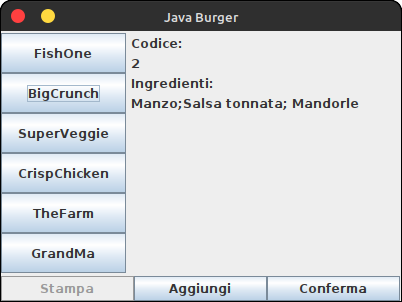

# Java Burger House

Si vuole definire un'applicazione per la gestione degli ordini di un pub. L'applicazione presenta un'interfaccia grafica che consente di visualizzare gli ingredienti per ciascun panino offerto dal menu prima di aggiungerlo all'ordine. 

L'interfaccia grafica avrà il seguente aspetto:

## Schema dell'interfaccia grafica

- View extends JFrame (BorderLayout)
  
  - WEST = JPanel (pnlSx, GridLayout (0,1)
    
    - JButton[n] (array di n pulsanti)
  
  - CENTER = JPanel (pnlCentral, FlowLayout (FlowLayout.LEFT))
    
    - JPanel (pnlLabel, GridLayout(0,1))
      
      - JLabel("Codice:")
      
      - JLabel lblCode
      
      - JLabel("Ingredienti:")
      
      - JLabel lblIngredienti
  
  - SOUTH = JPanel (pnlDown, GridLayout(1,0))
    
    - JButton btnStampa
    
    - JButton btnAggiungi
    
    - JButton btnConferma
  
  Il numero di pulsanti presenti a sinistra è il parametro passato al costruttore della View. Il testo presente su ciascun pulsante verrà impostato dal controller.
  
  ## Logica dell'applicazione
  
  > 1. Il menu contiene un certo numero di panini (n); le informazioni sui panini (codice, nome, ingredienti e costo) sono memorizzate in un file di testo strutturato (CSV) "panini.txt", gli igredienti sono memorizzati come un'unica stringa per semplicità.
  > 
  > 2. Definire una classe Panino con gli attributi necessari ed i metodi getter per ciascun attributo
  > 
  > 3. La classe Model che gestisce la logica dell'applicazione manterrà una struttura (Collection di oggetti Panino, p.es.: un'ArrayList) e una lista contenente i panini ordinati (definire una classe RigaOrdine che contiene due attributi: il codice del panino ordinato e la quantità.
  >    
  >    La classe Model dovrà contenere i seguenti metodi:
  >    
  >    1. **public int getN()** //restituisce il numero di panini presenti nella Collection
  >    
  >    2. **public Collection<Integer> getCodes()** //restituisce una collezione dei codici di tutti i panini
  >    
  >    3. **public void aggiungiPanino(int codice)**//Aggiunge una nuova riga all'ordine o incrementa il numero di panini di quel tipo se già presente nell'ordine
  >    
  >    4. **public void resetOrdine()** //Cancella l'ordine
  >    
  >    5. **public String getIngredienti(int codice)** //Restituisce la stringa degli ingredienti del panino il cui codice è passato come argomento
  >    
  >    6. **public String getNome(int codice)** //Restituisce il nome del panino dato il codice
  >    
  >    7. **public String getOrdine()** //Restituisce una stringa contenente il dettaglio dell'ordine effettuato: \<nome panino\> qta x \<costo\>
  >    
  >    8. **public int getCodice(String nome)** //Restituisce il codice del panino il cui nome è passato come argomento

Definire la classe Controller **senza** definire i Listener per ciascun pulsante (Questa parte sarà oggetto di una lezione successiva)
